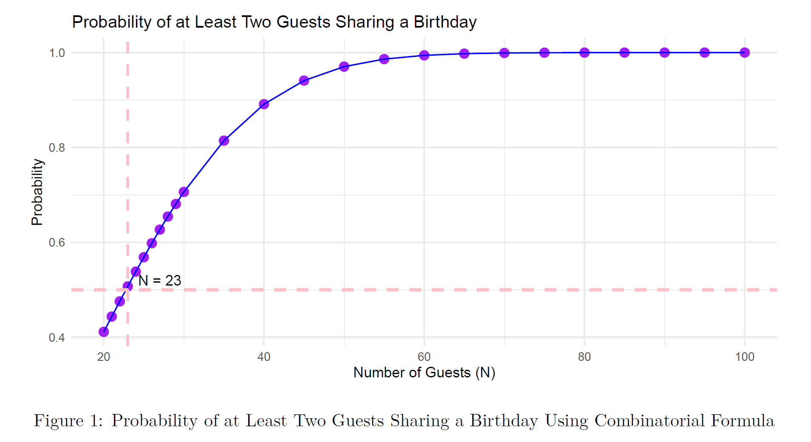
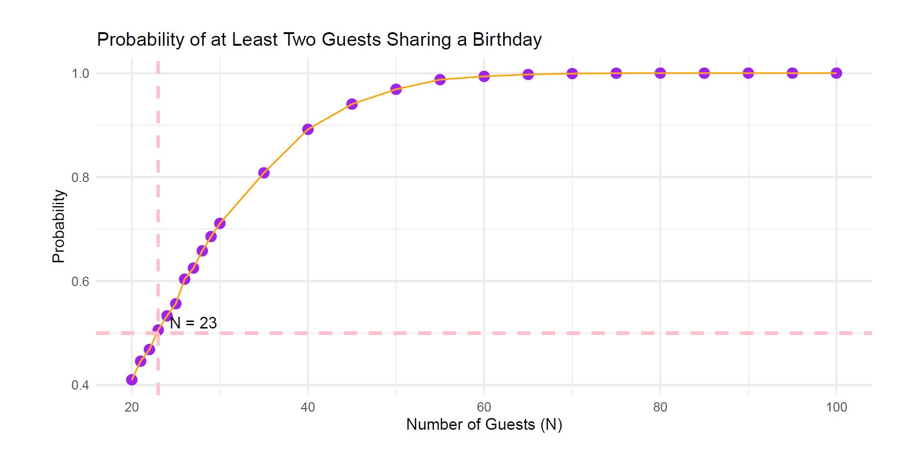
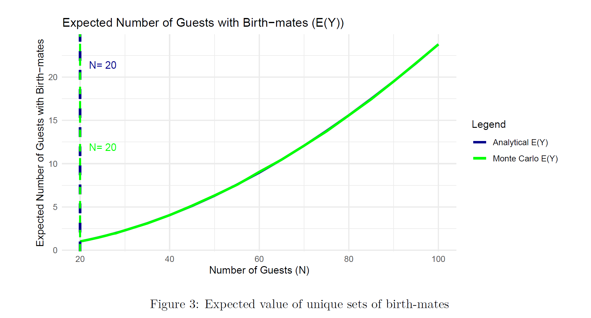
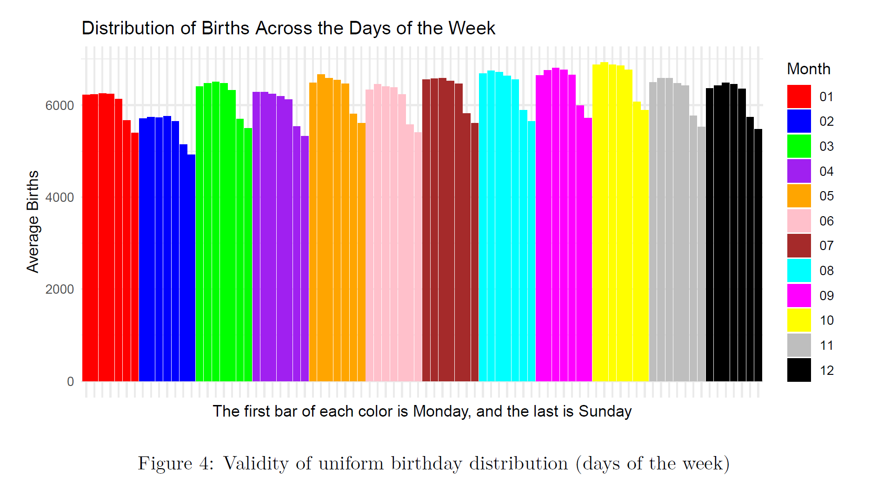
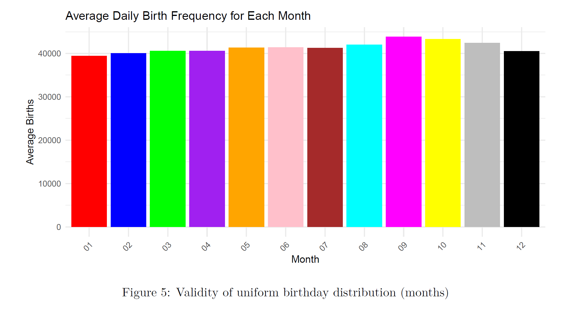
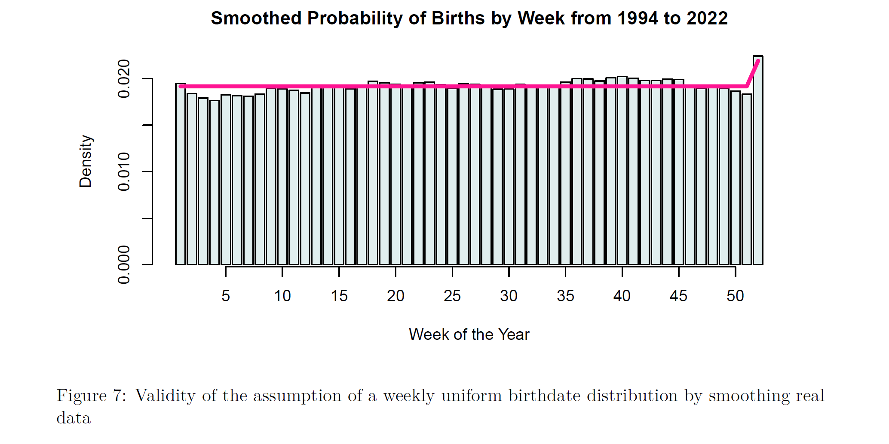
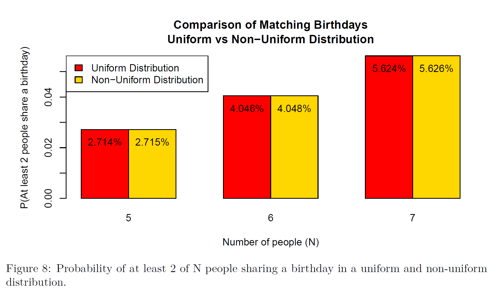

# The Birthday Paradox

Birthday paradox in Malaysia. This project was completed as a group project for the University of Calgary course DATA602 – Statistical Data Analysis.

## Introduction

The birthday paradox is mathematical phenomena which describes the probability of two people sharing the same birthday. The reason this phenomena is considered a paradox, is the fact that statistically the probability of two people sharing the same birthday is higher than what most people would expect.
The goal of this group project is to calculate the probability of the shared birthdays using two different approaches. The first approach is the **Exact Probability Formula** and the second approach is **Monte Carlo Simulation**.

The following parts will discuss these approaches under various conditions:

## Part 1. Exact Probability Using Combinatorial Formula

The formula used for calculating the exact probability:

$$
1 - \frac{N! \cdot \binom{365}{N}}{365^N}
$$



According to figure 1, which depicts the probability of at least two guests in a party of N guests sharing the same birthday, when there is at least 23 guests at the party the probability of at least 2 guests sharing the same birthday is more than 50%.

## Part 2. Probability Using Monte-Carlo Simulation

The probability that all $N$ people have unique birthdays
$$
P(\text{no shared birthdays}) = \frac{365}{365} \times \frac{364}{365} \times \frac{363}{365} \times ...\times \frac{365-N-1}{365}
$$

$$
= \prod_{k = 0}^{N-1} (1 - \frac{k}{365})
$$

The probability that at least two people share a birthday:
$$
P(\text{at least 2 people share birthdays}) = 1 - P(\text{no shared birthdays})
$$

$$
= 1 - \prod_{k = 0}^{N-1} (1 - \frac{k}{365})
$$

Performing the Monte-Carlo Simulation with repetition of $R=10000$



Figure 2, illustrates the probability of two guests sharing the same birthday in a party of N guests using the Monte-Carlo simulation. In comparison to the **combinatorial formula**, which provides a precise probability, **Monte Carlo simulation**, estimates the probability by performing multiple random simulations. This is the reason that the value of N resulted from the Monte Carlo simulation is different from the combinatorial formula. Furthermore, the Monte Carlo simulation provides an estimate and contains the element of randomness. In order to reduce the difference between the Monte Carlo simulation and combinatorial formula, one can increase the number of simulations.

## Part 3. 

The random variable $Y_{i}$ is defined as:

$$
Y_i =
\begin{cases}
1, & \text{if Guest } i \text{ has at least 1 birth-mate,} \\
0, & \text{otherwise,}
\end{cases}
$$


The Expected Value $E(Y)$ is:

$$
E(Y) = \sum_{i = 1}^{N} E(Y_{i})
$$

If guest $i$ does not have any birth-mates: $P(Y_{i} = 0) = (\frac{364}{365})^{N-1}$

If guest $i$ has at least 1 birth-mate: $P(Y_{i} = 1) = 1 - (\frac{364}{365})^{N-1}$

Therefore the Expected Value $E(Y)$ can be calculated as:


$$
E(Y) = \sum_{i = 1}^{N} E(Y_{i}) = N \cdot (1 - (\frac{364}{365})^{N-1})
$$


We use the Monte-Carlo Simulations to compute the expected value of **the number of guests who have birth-mates**

The minimum number of $N$ which have at least 2 guests to have birth-mates:

```{r part3_calc}
min_N = ceiling(min(results$N[results$Analytical_EY >= 1]))
cat("The minimum number of guests where E(Y) >= 1 is:", min_N)
```
The minimum number of guests where E(Y) >= 1 is: 20

The result is not surprising because of the following reasons:

* As $N$ increases, the probability of birth-mates increases.

* It is surprising because the number of guests required $(20)$ is relatively small compared to the total number of days in a year $(365)$.

* This result is a consequence of the birthday problem, which shows that shared birthdays become likely even in small groups due to the combination nature of the problem.

* The intuition that shared birthdays are rare is often incorrect because people underestimate the number of possible pairs of guests that can share a birthday.



Figure 3 illustrates the expected number of guests with birth-mates using **Monte-Carlo Simulation** and the **Expected Value**. As $N$ increases, $E(Y)$ also rises, indicating a higher probability of guests sharing birthdays. By $N = 100$, $E(Y)$ becomes significantly larger, demonstrating that in larger groups, shared birthdays are almost certain. This steep increase occurs because the number of possible birthday pairs grows much faster as the number of guests increases, making shared birthdays increasingly likely. This phenomenon often surprises people, as it feels counter intuitive that shared birthdays become so probable even in relatively small groups. The graph effectively captures this transition, highlighting the fascinating nature of probability in real-world scenarios.

## Part 4. Validity of the Assumption of a Uniform Birthday Distribution (Real Data)

For verifying this assumption, we will use the Malaysia dataset that provides daily count of births from 1920 to 2022. The data will be summarized in terms of the following statistics:

$$
\text{Average number of births on day j of month k} = 
$$

$$
\small
\sum_{m=1}^{M} (\text{number of births on day } j \text{ of month } k \text{ in year } m) \times \frac{(\text{total number of births on day } j \text{ of month } k \text{ over } M \text{ years})}{(\text{total number of births in month } k \text{ over } M \text{ years})}
$$

$$
\text{Average daily birth frequency in month k} =
$$

$$
\small
\sum_{m=1}^{M} \left(\frac{(\text{number of births on day } j \text{ of month } k \text{ in year } m)}{(\text{number of days in month } k)} \times \frac{(\text{total number of births in month } k \text{ over } M \text{ years})}{(\text{total number of births over } M \text{ years})} \right)
$$

for $\text{j=1 (Monday),...,7(Sunday)}$ and for $\text{k=1 (January),...,12(December)}$, where $m \in \{1,...,M\}$ indicates the year for which data on daily live births were obtained.





The Chi-Square Goodness of Fit Test is a statistical test used to analyze the difference between the observed and expected frequency distribution values in categorical data.The chi-square goodness of fit test is used to measure the significant difference between the expected and observed frequencies under the null hypothesis that there is no difference between the expected and observed frequencies.The test will be perform to validate if birthdays followed a uniform distribution between 1994 and 2022 in Malaysia.

- **Null Hypothesis (H0)**: The observed data follows a uniform distribution.

- **Alternative Hypothesis (H1)**: The observed data does not follow a uniform distribution.


The **Chi square test** shows high discrepancy between the real data and the expected data. In this test the null hypothesis assumed that births are equally likely on any day of the year.However, the test strongly rejects this assumption, since p-value is extremely low, close to 0 $(2.2e-16)$, which is less than the significance level $0.05$, meaning births are not uniformly distributed across the year.Some days have more births than expected, while others have fewer.This can also be confirmed in the graph, since the red line wich represents the uniform distribution is far from the real behavior represented by the blue bars.


## Part 5. Validity of the Assumption of a Uniform Birthday Distribution (Using Smoothed Real Data)

After verifying the presence of a weekly cyclical pattern in daily births, we now investigate whether smoothing the data—by applying a 7-day moving average—can support the assumption of a uniform distribution of births.

The first step involves smoothing the data per day using a 7-day moving average:

$$
\text{Smoothed}(d) = \frac{\sum_{i=0}^6 \text{Value}(d + i)}{7}
$$

Next, we organize the probabilities by week. The probability $P_\ell$ of a birth occurring in week $\ell$ is defined as:

$$
P_\ell = P(\text{a birth occurs on week } \ell) =
\begin{cases}  
\sum_{j=7\ell - 6}^{7\ell} p_j = \frac{7}{365}, & \text{for } \ell = 1, \dots, 51 \\  
\sum_{j=358}^{365} p_j = \frac{8}{365}, & \text{for } \ell = 52  
\end{cases}
$$

Here, weeks 1 to 51 have 7 days each ($\frac{7}{365}$), and week 52 has 8 days ($\frac{8}{365}$).

To assess whether the smoothed data follows a uniform distribution, we first compare the observed smoothed probabilities with the expected probabilities under a uniform distribution. The expected probabilities are:

$$
\text{Expected Probability} = \left( \text{rep}\left(\frac{7}{365}, \text{times} = 51\right), \frac{8}{365} \right)
$$



The plot of the smoothed probabilities shows a trend similar to the expected uniform distribution, suggesting that smoothing the data may align it with a uniform distribution. 

To confirm this, we perform a chi-square goodness-of-fit test with the following hypotheses:

- **Null Hypothesis (H0)**: The observed data follows a uniform distribution.

- **Alternative Hypothesis (H1)**: The observed data does not follow a uniform distribution.

```{r part5_chiprint}
chi = chisq.test(x=Smooth_week$Percentage, p=expected)
print(chi)
```

The test results yield a p-value of 1 (> 0.05), which means we fail to reject the null hypothesis (H0). This indicates that, after smoothing, the data is consistent with a uniform distribution.

## Part 6. Non-Uniform Distribution of Birthdays

For the final part of our analysis, we will look at how the probability of $N$ people sharing a birthday changes if the distribution of birthdays is non-uniform.

To do this, we will split the birth data from Malaysia into 7 groups of different sizes.

Table 1: Probability that a birthday falls on a day within each group.


Next, instead of using the probability function from part 1 which assumed a normal distribution of birthdays, we have to account for the different chances that the $N$ people belong to different combinations of groups. For example, with $N = 5$ people, there are $\binom{5+7-1}{5}$ $= 462$ different ways of splitting the guests into different groups. For example, we can enumerate these possibilities for $N = 5$ starting with $(1, 1, 1, 1, 1)$ (all five people born in group 1), continuing with $(1, 1, 1, 1, 2)$ (four people born in group 1 and one person born in group 2), etc. and ending with $(7, 7, 7, 7, 7)$ (all five people being born in group 7), ensuring no enumeration is repeated by enforcing that the numbers in any one possibility are always sorted (for example, the possibility that one person is born in each of groups 2, 4, and 7 while two people are born in group 5 will only be enumerated once, and be listed as $(2, 4, 5, 5, 7)$).

To calculate the probability that all $N$ guests have **distinct** birthdays, we adapt the formula used in part 1 ($N! \cdot \binom{365}{N}\cdot\frac{1}{365^N}$) to be used in a non-uniform distribution. The result is $N! \cdot \sum_{n\in\beta}(\prod_{s=1}^{7}\binom{\delta_s}{n_s}\pi_s^{n_s})$ where $\delta_s$ is the number of days contained in group $s$, $n_s$ is the number of people who have a birthday in group $s$ within enumeration $n$, $\pi_s$ is the probability that a birthday falls on a day within group $s$, and $\beta$ is the list of all $\binom{N+7-1}{N}$ ways to organize $N$ people into $7$ groups. Finally, we subtract our result for distinct birthdays from $1$ to get the probability that at least two of the $N$ people share a birthday.




From these results, we can see that the probability for two people to share a birthday **slightly increases** for the non-uniform distribution that we used. The increase in probability was only marginal in this case because the 7 groups we defined all had very similar probabilities per day, only spanning a small range from 0.00267 to 0.00285. If the probabilities spanned a greater range, or if the most common group had a higher probability, we would see a more noticeable effect on the chance of at least two people sharing a birthday increasing for the non-uniform distribution. This is because when a group has greater relative odds for a birthday, it becomes increasingly likely that multiple people will be born in that specific group because it has higher odds. As a result, the distribution with the lowest probability of shared birthdays is the uniform distribution because no group has a greater chance of resulting in a shared birthday than any other group.

## Conclusion

From our analysis of the birthday paradox, we observed the following:

* The number of people required to have a 50% of at least two sharing a birthday is 23, both by statistical calculation and Monte Carlo simulation.
* The expected value for number of birthdays that result in birth-mates is 20, lower than the number of people required for a 50% chance because of cases where more than 2 people share a birthday.
* When looking at real world data, we do not observe a uniform distribution of birthdays. Weekday births are consistently more common than weekend births.
* Smoothing the real world data by week provides a uniform distribution.
* When calculating probabilities of shared birthday for a non-uniform distribution, the likelihood of shared birthdays increases, but only slightly.

## Refrences

* Government of Malaysia Official Open Data Portal (2023). [Dataset] https://data.gov.my/data-catalogue/births


